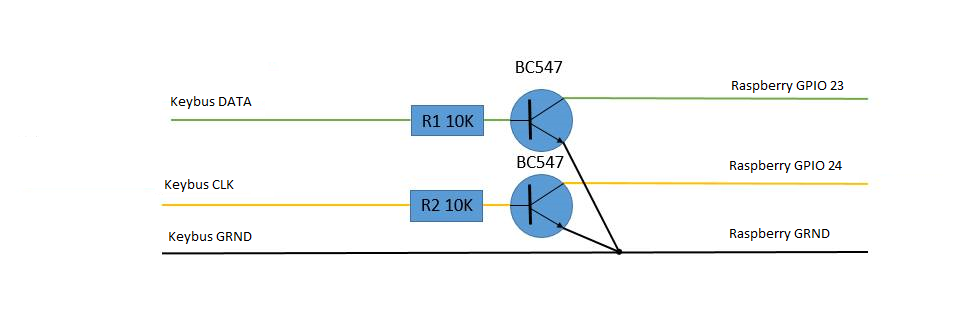

# keybusdev.ko

A Linux Kernel Module to interact with DSC keybus protocol using GPIO on Raspberry PI

## Features

* exposes a /dev/keybus device for reading all the packets arriving from the alarm system
* exposes a kernel object under /sys/keybus for reading the latest state of the alarm system and statistics

Tested on `Linux raspberrypi 4.1.13+ #826 PREEMPT Fri Nov 13 20:13:22 GMT 2015 armv6l GNU/Linux`

## Usage:

Connect keybus CLK to GPIO 24 and keybus DATA to GPIO 23. Remember
that keybus is 12V where as Raspberry PI can only cope with 3.3V. You
need some shield in between. Mine is based on configuring the GPIO as
pull up and then pulling them down to GRDN when keybus is high.



1. Configure, compile and install `keybusdev-overlay.dts`

If you want to use other pins or some other kind of shield, configure
the values in the `dts` file accordingly. Then compile it and copy it
to the boot directory.


```
dtc -I dts -O dtb -o keybusdev-overlay.dtb keybusdev-overlay.dts
cp keybusdev-overlay.dtb /boot/overlays

```

2. Boot the box

Boot the box so that the overlays take effect.

3. compile and install the kernel module

```
make
insmod keybusdev.ko 
```

## The /sys/keybus/ directory

You can use the files under `/sys/keybus` to retrieve statistics and the latest keybus device status.

For example:

```
cat /sys/keybus/keybus/keybus_status
```

## The /dev/keybus device

The device will internally buffer up to 128 events. If there are more
events coming in before old events are read by user code, then older
events are overwritten.

To read an event, open the `/dev/keybus` device an read. To read the
next event, seek to the beginning of the file and read again. Reading
from offset 0 will block until there is a new event.

You can also use `cat` to retrieve the events.

```
while cat /dev/keybus; do sleep 1; done
```
